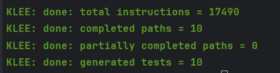
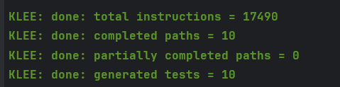
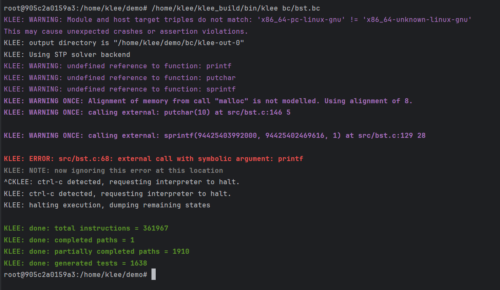
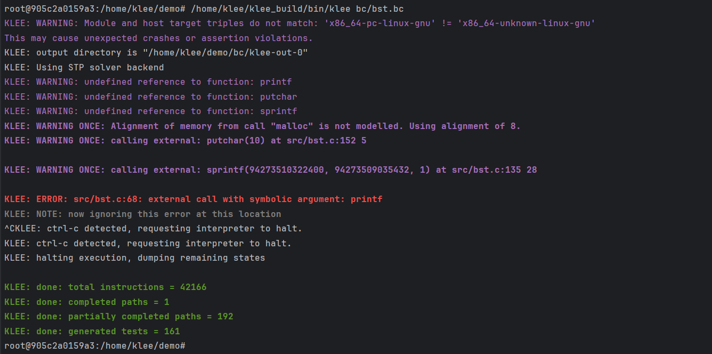

# 2024 Spring SoftwareTest Lab2

> 21302010042 
> 侯斌洋

## 1. 目录介绍

* `image/`：存放`Report.md`中的图片
* `log/`：存放生成的测试用例及运行结果，与后文中的介绍的各个log文件对应。
    * `symbolic.log`：`symbolic.c` 的测试用例及运行结果
    * `maze.log`：`maze.c` 的测试用例及运行结果
    * `bst_origin.log`：未修改的 `bst.c` 的测试用例及运行结果
    * `bst_add_null.log`：添加 `tree->root = NULL` 后的 `bst.c` 的测试用例及运行结果
    * `bst_add_null_rm_atoi.log`：添加 `tree->root = NULL` 和删除 `atoi` 后的 `bst.c` 的测试用例及运行结果
    * `bst_add_null_rm_atoi_change_del.log`：修复错误后的 `bst.c` 的测试用例及运行结果
* `src/`：存放源代码
    * `symbolic.c`：未修改
    * `maze.c`：增加了`klee_make_symbolic`。
    * `bst.c`：增加了`klee_make_symbolic`。已修复错误。
* `Report.md`：实验报告。

## 2. 运行命令

```shell
# prepare
docker build -t kawaii .
docker run --name klee -p 35022:22 -itd kawaii
docker exec -it klee bash
sudo su
cd demo && make all

# run test for symbolic.c
/home/klee/klee_build/bin/klee bc/symbolic.bc

export LD_LIBRARY_PATH=/home/klee/klee_build/lib/:$LD_LIBRARY_PATH
gcc -L /home/klee/klee_build/lib/ src/symbolic.c -lkleeRuntest

for i in {1..6}; do
    echo "--------------------------------------------------"  | tee -a symbolic.log
    ktest_file="bc/klee-out-0/test$(printf "%06d" $i).ktest"
    /home/klee/klee_build/bin/ktest-tool "$ktest_file"  | tee -a symbolic.log
    KTEST_FILE="/home/klee/demo/$ktest_file" ./a.out  | tee -a symbolic.log
    echo "--------------------------------------------------"  | tee -a symbolic.log
done

# run test for maze.c
/home/klee/klee_build/bin/klee bc/maze.bc

export LD_LIBRARY_PATH=/home/klee/klee_build/lib/:$LD_LIBRARY_PATH
gcc -L /home/klee/klee_build/lib/ src/maze.c -lkleeRuntest

for i in {1..309}; do
    echo "--------------------------------------------------"  | tee -a maze.log
    ktest_file="bc/klee-out-0/test$(printf "%06d" $i).ktest"
    /home/klee/klee_build/bin/ktest-tool "$ktest_file"  | tee -a maze.log
    KTEST_FILE="/home/klee/demo/$ktest_file" ./a.out  | tee -a maze.log
    echo "--------------------------------------------------"  | tee -a maze.log
done


# run test for bst.c
/home/klee/klee_build/bin/klee bc/bst.bc
export LD_LIBRARY_PATH=/home/klee/klee_build/lib/:$LD_LIBRARY_PATH
gcc -L /home/klee/klee_build/lib/ src/bst.c -lkleeRuntest
# origin
for i in {1..10}; do
    echo "--------------------------------------------------"  | tee -a bst_origin.log
    ktest_file="bc/klee-out-0/test$(printf "%06d" $i).ktest"
    /home/klee/klee_build/bin/ktest-tool "$ktest_file"  | tee -a bst_origin.log
    echo "--------------------------------------------------"  | tee -a bst_origin.log
done
# add null
for i in {1..10}; do
    echo "--------------------------------------------------"  | tee -a bst_add_null.log
    ktest_file="bc/klee-out-0/test$(printf "%06d" $i).ktest"
    /home/klee/klee_build/bin/ktest-tool "$ktest_file"  | tee -a bst_add_null.log
    KTEST_FILE="/home/klee/demo/$ktest_file" ./a.out  | tee -a bst_add_null.log
    echo "--------------------------------------------------"  | tee -a bst_add_null.log
done
# add null and rm atoi
for i in {1..1638}; do
    echo "--------------------------------------------------"  | tee -a bst_add_null_rm_atoi.log
    ktest_file="bc/klee-out-0/test$(printf "%06d" $i).ktest"
    /home/klee/klee_build/bin/ktest-tool "$ktest_file"  | tee -a bst_add_null_rm_atoi.log
    KTEST_FILE="/home/klee/demo/$ktest_file" ./a.out  | tee -a bst_add_null_rm_atoi.log
    echo "--------------------------------------------------"  | tee -a bst_add_null_rm_atoi.log
done
# add null and rm atoi and change del
for i in {1..161}; do
    echo "--------------------------------------------------"  | tee -a bst_add_null_rm_atoi_change_del.log
    ktest_file="bc/klee-out-0/test$(printf "%06d" $i).ktest"
    /home/klee/klee_build/bin/ktest-tool "$ktest_file"  | tee -a bst_add_null_rm_atoi_change_del.log
    KTEST_FILE="/home/klee/demo/$ktest_file" ./a.out  | tee -a bst_add_null_rm_atoi_change_del.log
    echo "--------------------------------------------------"  | tee -a bst_add_null_rm_atoi_change_del.log
done
```

## 3. symbolic.c

* 运行结果


* 生成 klee-out-0 ，其中包含了 6 个测试用例。

* 测试用例及运行结果见 `/log/symbolic.log`

* log文件的格式如下：每个测试用例的结果之间用 `----------` 分隔，前半部分是测试用例的内容，后半部分是运行测试用例的结果。

```shell
--------------------------------------------------
# 测试用例的内容
ktest file : 'bc/klee-out-0/test000001.ktest'
args       : ['a.out']
...
object x: text: ........
# 运行测试用例的结果
...
--------------------------------------------------
```

* 由于 `segmentation fault`不会输出到log中，故`symbolic.log`和`bst.log`中的`segmentation fault`为实际运行后手动添加的。

> 由 symbolic.log 可以看出 symbolic.c 在测试3,4,5,6中都出现了 segmentation fault。
> 这些测试用例中都有，n == 0，choice == 3，arrLen == 0。
> 由上面图片的输出可知在free_then_set_null函数中发生了错误，观察得到case3和case4没有break,且case4中p没有初始化但执行了freecaoz
> 综上，case4中存在 int *p 未申请内存但却free的错误。此外，case3和case4还可能存在遗漏break的错误。


## 4. maze.c

* 在`main()`中添加如下代码，以便于klee生成测试用例

```c
klee_make_symbolic(program, ITERS * sizeof(char), "program");
```

* 运行结果


* 生成 klee-out-0 ，其中包含了 309 个测试用例。

* 测试用例及运行结果见 `/log/maze.log`

* 如下为搜索 win 的测试用例的结果

```shell
Iteration: 10 / 28
+-+---+---+
|X|XXXXX|#|
|XXX--+XXX|
| |   | | |
| +-- | | |
|     |   |
+-----+---+

You win!
Your solution: sddwddddsddw����������������	

Iteration: 20 / 28
+-+---+---+
|X|XXXXX|#|
|X|X--+XXX|
|X|XXX| | |
|X+--X| | |
|XXXXX|   |
+-----+---+

You win!
Your solution: ssssddddwwaawwddddsddw������	

Iteration: 16 / 28
+-+---+---+
|X|XXXXX|#|
|XXX--+X|X|
| |   |X|X|
| +-- |X|X|
|     |XXX|
+-----+---+

You win!
Your solution: sddwddddssssddwwww����������	

Iteration: 26 / 28
+-+---+---+
|X|XXXXX|#|
|X|X--+X|X|
|X|XXX|X|X|
|X+--X|X|X|
|XXXXX|XXX|
+-----+---+

You win!
Your solution: ssssddddwwaawwddddssssddwwww	
```

> 由上面4个测试用例的结果可以看出，除了最后一个结果外，其他的结果都是错误的。这是因为maze.c中的逻辑错误导致的。
> 具体来说，程序可以踩过第三行的墙而不失败，由此导致上面的错误。
> 如下为存在逻辑错误的代码
```c
void status() {
    if (maze[y][x] == '#') {
        win();
    }
    // here is the bug
    if (maze[y][x] != ' ' &&
        !((y == 2 && maze[y][x] == '|' && x > 0 && x < W))) {
        x = ox;
        y = oy;
    }
    if (ox == x && oy == y) {
        lose();
    }
}
```
> 可以看出，当处于第三行且 maze[y][x] == '|'时，程序不会失败，相当于第三行的墙被忽略了。
> 要进行修改的话，只需修改判断条件即可。
```c
void status() {
    if (maze[y][x] == '#') {
        win();
    }
    // here is the right code
    if (maze[y][x] != ' ') {
        x = ox;
        y = oy;
    }
    if (ox == x && oy == y) {
        lose();
    }
}
```

## 5. bst.c

* 在`main()`中添加如下代码，以便于klee生成测试用例

```c
int argc = 1;
const int max_argc = 11; // 设置一个合理的最大值
char *argv[max_argc];
for (int i = 0; i < max_argc; i++) {
    argv[i] = malloc(11);
}
klee_make_symbolic(&argc, sizeof(argc), "argc");
klee_assume(argc >= 1);
klee_assume(argc <= 10);


for (int i = 1; i < argc; i++) {
    char name[20];
    sprintf(name, "argv%d", i);
    klee_make_symbolic(argv[i], 11, name);
}
```

> 上面的代码中，对argc和argv进行了符号化。
> 为了控制测试用例的数量，设置了argc的范围为[1, 10]。
> 对于argv，设置了字符串最大长度为11，因为INT_MAX字符串长度不会超过11，且对每个argv进行命名并符号化。

### 5.1 对未修改的 bst.c 进行测试

* 运行结果



* 生成 klee-out-0 ，其中包含了 10 个测试用例。

* 测试用例及运行结果见 `/log/bst_origin.log`

> 可以看出，对于这10个测试用例，程序要么直接卡住，要么直接 segmentation fault。
> 使用出现 segmentation fault 的测试用例运行并分析，发现 tree->root 未经初始化，应当初始化为NULL。
> 如下
```c
int main(int argc, char **argv) {
    ...
    struct BST *tree = malloc(sizeof(struct BST));
    // add null initialization here
    tree->root = NULL;
    ...
}
```

### 5.2 添加 tree->root = NULL 后进行测试

* 运行结果



* 生成 klee-out-0 ，其中包含了 10 个测试用例。

* 测试用例及运行结果见 `/log/bst_add_null.log`

> 可以看出，程序此时不会出现卡住或者 segmentation fault 的情况。但是klee产生的测试用例中数字全部为0。
> 这是因为在 bst.c 中使用了 atoi 函数，klee可能无法对 atoi 反向计算条件，导致所有的数字都为0。
> 为了生成更多也更合理的测试用例，将 bst.c 中的 atoi 函数去除，并直接使用c语言中的隐式类型转换。
```c
...
for (int i = 1; i < argc; i++) {
        // int insertVal = atoi(argv[i]);
        int insertVal = *argv[i]; // 这里直接使用隐式类型转换，便于klee生成测试用例
        insert(tree, insertVal);
}
...
```


### 5.3 添加 tree->root = NULL 和 删除 atoi 后进行测试

* 运行结果



* 生成 klee-out-0 ，其中包含了 1638 个测试用例。

* 测试用例及运行结果见 `/log/bst_add_null_rm_atoi.log`

> 可以看出，程序此时生成了更多的测试用例，且测试用例中的数字不再都为0，说明将 atoi 改为隐式类型转换是比较有效的。
> 然而，可以发现在删除所有的节点后，程序仍会打印出部分数字，说明 deleteNode() 的逻辑存在问题，需要进行修改。
> 根据出现错误的测试用例，进行如下修改
```c
// change here
struct TreeNode* deleteNode(struct TreeNode* root, int key) {
    if (root == NULL) return root;

    if (key < root->val) {
        root->left = deleteNode(root->left, key);
    } else if (key > root->val) {
        root->right = deleteNode(root->right, key);
    } else {
        if (root->left == NULL) {
            struct TreeNode* temp = root->right;
            //free(root);
            return temp;
        } else if (root->right == NULL) {
            struct TreeNode* temp = root->left;
            //free(root);
            return temp;
        }

        struct TreeNode* temp = findMin(root->right);
        root->val = temp->val;
        root->right = deleteNode(root->right, temp->val);
    }
    return root;
}

int main(){
    ...
    for (int i = 1; i < argc; i ++) {
        int deleteVal = *argv[i];
        // change here
        tree->root = deleteNode(tree->root, deleteVal);
    }
    ...
}
```

### 5.4 修改完代码后进行测试

* 运行结果



* 生成 klee-out-0 ，其中包含了 161 个测试用例。

* 测试用例及运行结果见 `/log/bst_add_null_rm_atoi_change_del.log`

> 可以看出，经过修改后，删除节点后不再打印出删除的节点，程序运行正常。


Repo: https://github.com/HBY-STAR/2024_Spring_SoftwareTest_Lab