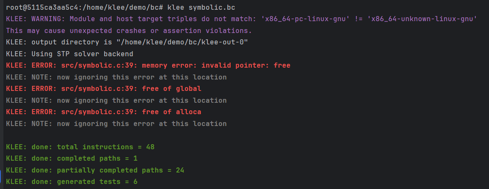
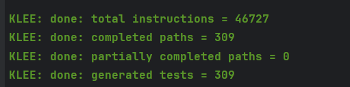

# 2024 Spring SoftwareTest Lab2

> 21302010042 
> 侯斌洋

## Run

```shell
docker build -t kawaii .
docker run --name klee -p 35022:22 -itd kawaii
docker exec -it klee bash
sudo su
cd demo && make all

/home/klee/klee_build/bin/klee bc/symbolic.bc
/home/klee/klee_build/bin/klee bc/maze.bc
/home/klee/klee_build/bin/klee -posix-runtime  bc/bst.bc -sym-args 0 10 11 
/home/klee/klee_build/bin/klee bc/bst.bc

export LD_LIBRARY_PATH=/home/klee/klee_build/lib/:$LD_LIBRARY_PATH
gcc -L /home/klee/klee_build/lib/ src/maze.c -lkleeRuntest

for i in {1..309}; do
    echo "--------------------------------------------------"  | tee -a maze.log
    ktest_file="bc/klee-out-0/test$(printf "%06d" $i).ktest"
    /home/klee/klee_build/bin/ktest-tool "$ktest_file"  | tee -a maze.log
    KTEST_FILE="/home/klee/demo/$ktest_file" ./a.out  | tee -a maze.log
    echo "--------------------------------------------------"  | tee -a maze.log
done


export LD_LIBRARY_PATH=/home/klee/klee_build/lib/:$LD_LIBRARY_PATH
gcc -L /home/klee/klee_build/lib/ src/bst.c -lkleeRuntest

KTEST_FILE="/home/klee/demo/bc/klee-out-0/test000001.ktest" ./a.out

# origin
for i in {1..10}; do
    echo "--------------------------------------------------"  | tee -a bst_origin.log
    ktest_file="bc/klee-out-0/test$(printf "%06d" $i).ktest"
    /home/klee/klee_build/bin/ktest-tool "$ktest_file"  | tee -a bst_origin.log
    echo "--------------------------------------------------"  | tee -a bst_origin.log
done

# add null
for i in {1..10}; do
    echo "--------------------------------------------------"  | tee -a bst_add_null.log
    ktest_file="bc/klee-out-0/test$(printf "%06d" $i).ktest"
    /home/klee/klee_build/bin/ktest-tool "$ktest_file"  | tee -a bst_add_null.log
    KTEST_FILE="/home/klee/demo/$ktest_file" ./a.out  | tee -a bst_add_null.log
    echo "--------------------------------------------------"  | tee -a bst_add_null.log
done

# add null and rm atoi
for i in {1..1638}; do
    echo "--------------------------------------------------"  | tee -a bst_add_null_rm_atoi.log
    ktest_file="bc/klee-out-0/test$(printf "%06d" $i).ktest"
    /home/klee/klee_build/bin/ktest-tool "$ktest_file"  | tee -a bst_add_null_rm_atoi.log
    KTEST_FILE="/home/klee/demo/$ktest_file" ./a.out  | tee -a bst_add_null_rm_atoi.log
    echo "--------------------------------------------------"  | tee -a bst_add_null_rm_atoi.log
done

# add null and rm atoi and change del
for i in {1..474}; do
    echo "--------------------------------------------------"  | tee -a bst_add_null_rm_atoi_change_del.log
    ktest_file="bc/klee-out-0/test$(printf "%06d" $i).ktest"
    /home/klee/klee_build/bin/ktest-tool "$ktest_file"  | tee -a bst_add_null_rm_atoi_change_del.log
    KTEST_FILE="/home/klee/demo/$ktest_file" ./a.out  | tee -a bst_add_null_rm_atoi_change_del.log
    echo "--------------------------------------------------"  | tee -a bst_add_null_rm_atoi_change_del.log
done

```


## 1. symbolic.c

* 运行结果



* 生成 klee-out-0 ，其中包含了 6 个测试用例，如下：

```shell
root@5115ca3aa5c4:/home/klee/demo/bc# /home/klee/klee_build/bin/ktest-tool klee-out-0/test000001.ktest
ktest file : 'klee-out-0/test000001.ktest'
args       : ['symbolic.bc']
num objects: 3
object 0: name: 'n'
object 0: size: 4
object 0: data: b'\x00\x00\x00\x00'
object 0: hex : 0x00000000
object 0: int : 0
object 0: uint: 0
object 0: text: ....
object 1: name: 'choice'
object 1: size: 4
object 1: data: b'\x00\x00\x00\x00'
object 1: hex : 0x00000000
object 1: int : 0
object 1: uint: 0
object 1: text: ....
object 2: name: 'arr_len'
object 2: size: 4
object 2: data: b'\x00\x00\x00\x00'
object 2: hex : 0x00000000
object 2: int : 0
object 2: uint: 0
object 2: text: ....
```

```shell
root@5115ca3aa5c4:/home/klee/demo/bc# /home/klee/klee_build/bin/ktest-tool klee-out-0/test000002.ktest
ktest file : 'klee-out-0/test000002.ktest'
args       : ['symbolic.bc']
num objects: 3
object 0: name: 'n'
object 0: size: 4
object 0: data: b'\x00\x00\x00\x00'
object 0: hex : 0x00000000
object 0: int : 0
object 0: uint: 0
object 0: text: ....
object 1: name: 'choice'
object 1: size: 4
object 1: data: b'\x05\x00\x00\x00'
object 1: hex : 0x05000000
object 1: int : 5
object 1: uint: 5
object 1: text: ....
object 2: name: 'arr_len'
object 2: size: 4
object 2: data: b'\x00\x00\x00\x00'
object 2: hex : 0x00000000
object 2: int : 0
object 2: uint: 0
object 2: text: ....
```

```shell
root@5115ca3aa5c4:/home/klee/demo/bc# /home/klee/klee_build/bin/ktest-tool klee-out-0/test000003.ktest
ktest file : 'klee-out-0/test000003.ktest'
args       : ['symbolic.bc']
num objects: 4
object 0: name: 'n'
object 0: size: 4
object 0: data: b'\x00\x00\x00\x00'
object 0: hex : 0x00000000
object 0: int : 0
object 0: uint: 0
object 0: text: ....
object 1: name: 'choice'
object 1: size: 4
object 1: data: b'\x03\x00\x00\x00'
object 1: hex : 0x03000000
object 1: int : 3
object 1: uint: 3
object 1: text: ....
object 2: name: 'arr_len'
object 2: size: 4
object 2: data: b'\x00\x00\x00\x00'
object 2: hex : 0x00000000
object 2: int : 0
object 2: uint: 0
object 2: text: ....
object 3: name: 'p'
object 3: size: 8
object 3: data: b'\x00\x00\x00\x00\x00\x00\x00\x00'
object 3: hex : 0x0000000000000000
object 3: int : 0
object 3: uint: 0
object 3: text: ........
```

```shell
root@5115ca3aa5c4:/home/klee/demo/bc# /home/klee/klee_build/bin/ktest-tool klee-out-0/test000004.ktest
ktest file : 'klee-out-0/test000004.ktest'
args       : ['symbolic.bc']
num objects: 4
object 0: name: 'n'
object 0: size: 4
object 0: data: b'\x00\x00\x00\x00'
object 0: hex : 0x00000000
object 0: int : 0
object 0: uint: 0
object 0: text: ....
object 1: name: 'choice'
object 1: size: 4
object 1: data: b'\x03\x00\x00\x00'
object 1: hex : 0x03000000
object 1: int : 3
object 1: uint: 3
object 1: text: ....
object 2: name: 'arr_len'
object 2: size: 4
object 2: data: b'\x00\x00\x00\x00'
object 2: hex : 0x00000000
object 2: int : 0
object 2: uint: 0
object 2: text: ....
object 3: name: 'p'
object 3: size: 8
object 3: data: b'\x01\x01\x01\x01\x01\x01\x01\x01'
object 3: hex : 0x0101010101010101
object 3: int : 72340172838076673
object 3: uint: 72340172838076673
object 3: text: ........
```

```shell
oot@5115ca3aa5c4:/home/klee/demo/bc# /home/klee/klee_build/bin/ktest-tool klee-out-0/test000005.ktest
ktest file : 'klee-out-0/test000005.ktest'
args       : ['symbolic.bc']
num objects: 4
object 0: name: 'n'
object 0: size: 4
object 0: data: b'\x00\x00\x00\x00'
object 0: hex : 0x00000000
object 0: int : 0
object 0: uint: 0
object 0: text: ....
object 1: name: 'choice'
object 1: size: 4
object 1: data: b'\x03\x00\x00\x00'
object 1: hex : 0x03000000
object 1: int : 3
object 1: uint: 3
object 1: text: ....
object 2: name: 'arr_len'
object 2: size: 4
object 2: data: b'\x00\x00\x00\x00'
object 2: hex : 0x00000000
object 2: int : 0
object 2: uint: 0
object 2: text: ....
object 3: name: 'p'
object 3: size: 8
object 3: data: b'\xe0fa\x14>\x7f\x00\x00'
object 3: hex : 0xe06661143e7f0000
object 3: int : 139904606627552
object 3: uint: 139904606627552
object 3: text: .fa.>...
```

```shell
root@5115ca3aa5c4:/home/klee/demo/bc# /home/klee/klee_build/bin/ktest-tool klee-out-0/test000006.ktest
ktest file : 'klee-out-0/test000006.ktest'
args       : ['symbolic.bc']
num objects: 4
object 0: name: 'n'
object 0: size: 4
object 0: data: b'\x00\x00\x00\x00'
object 0: hex : 0x00000000
object 0: int : 0
object 0: uint: 0
object 0: text: ....
object 1: name: 'choice'
object 1: size: 4
object 1: data: b'\x03\x00\x00\x00'
object 1: hex : 0x03000000
object 1: int : 3
object 1: uint: 3
object 1: text: ....
object 2: name: 'arr_len'
object 2: size: 4
object 2: data: b'\x00\x00\x00\x00'
object 2: hex : 0x00000000
object 2: int : 0
object 2: uint: 0
object 2: text: ....
object 3: name: 'p'
object 3: size: 8
object 3: data: b'\x00\xa9\xff\xc6dU\x00\x00'
object 3: hex : 0x00a9ffc664550000
object 3: int : 93891323734272
object 3: uint: 93891323734272
object 3: text: ....dU..
```

## 2. maze.c

* 运行结果



* 生成 klee-out-0 ，其中包含了 309 个测试用例，如下：

```shell
```


## 3. bst.c


